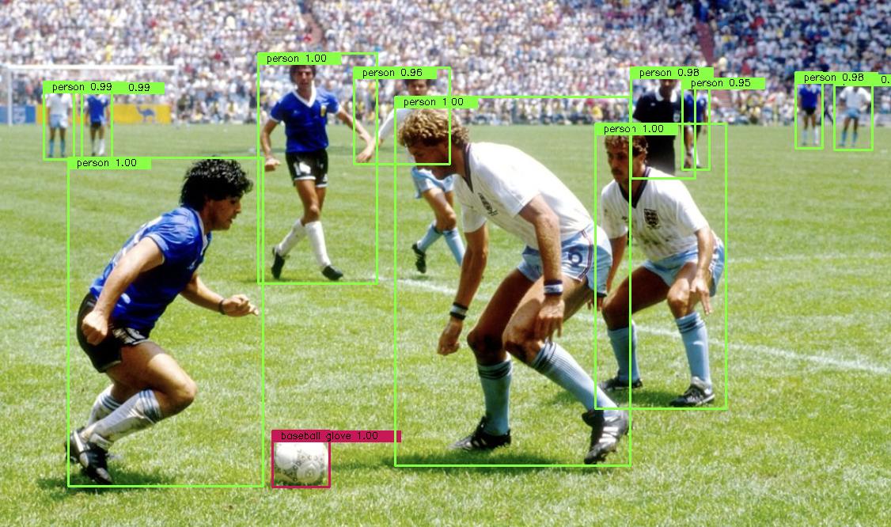

## torchvision fasterrcnn tutorial

This repository is a tutorial of faster rcnn using torchvision

The Characteristics of this repo
- [x] No Normalization
- [x] Dataset is coco (91 classes)
- [x] Easily extensible to other TORCHVISION models]

### Input and output

### Start Guide

- Run demo.py

### Reference

https://github.com/csm-kr/retinanet_pytorch/blob/master/demo.py

https://github.com/spmallick/learnopencv/blob/master/PyTorch-Mask-RCNN/PyTorch_Mask_RCNN.ipynb

